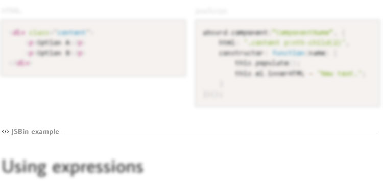

I'm currently working on the official site of [AbsurdJS](https://github.com/krasimir/absurd). There are a lot of code samples out there and I want to directly present them in [JSBins](http://jsbin.com/).[STOP] When there are several bins on the page it gets annoying. So, I decided to put a link to the example instead of adding it into the page. However that link doesn't look really good because it was too short and kinda alone. A few layout experiments and I came up with a good looking separator containing the link.

Here is the final result. 

There is a small [FontAwesome](http://fortawesome.github.io/Font-Awesome/icons/) in front of the link's label. The interesting thing is the line which is expanded to the end of the content's container. Here is the HTML markup which I had:

	<small class="jsbin">
        <a href="http://jsbin.com/zazat/2/edit">JSBin example</a>
    </small>

I didn't want to add new elements. I wanted everything to be done with CSS. In such cases I personally use [pseudo classes](http://krasimirtsonev.com/blog/article/CSS-before-and-after-pseudo-elements-in-practice). I started with the following styles:

	.jsbin {
	    display: block;
	}
	.jsbin:before {
	    content: " ";
	    display: block;
	    border-top: solid 1px #000;
	}

Because the `:before` pseudo element is a block element its width is automatically set to auto, which is 100% of the parent's width. The border at the top defines the desire line and it is indeed from the left to the right part of the &ltsmall> tag. Now it gets interesting. I had to move it a little bit down. I can't use absolute positioning because will lose the full width. Using of margins and padding didn't work because the inner &lt;a> tag is moved also. Then I decided to use the `transform` property.

	.jsbin:before {
	    content: " ";
	    display: block;
	    border-top: solid 1px #000;
	    transform: translate(95px,12px);
	    -webkit-transform: translate(95px,12px);
	    -ms-transform: translate(95px,12px);
	}

This moved the line to the position which I wanted. However there is bad side effect of this approach (it was bad at the beginning :)). The line goes outside the content's container. In my case I just set `overflow-x: hidden` and that did the trick. Of course in some cases you may not be able to do this. And the final variant looks like that:

	.jsbin {
	    display: block;
	    overflow-x: hidden;
	}
	.jsbin:before {
	    content: " ";
	    display: block;
	    border-top: solid 1px #000;
	    transform: translate(95px,12px);
	    -webkit-transform: translate(95px,12px);
	    -ms-transform: translate(95px,12px);
	}