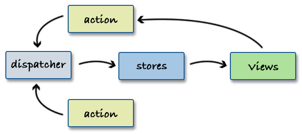

# Flux architecture in 750 bytes

I'm obsessed by making my code simpler. I didn't say *smaller* because having less code doesn't mean that is simple and easy to work with. I believe that big part of the problems in the software industry come from the unnecessary complexity. Complexity which is a result of our own abstractions. You know, we (the programmers) like to abstract. We like placing things in black boxes and hope that these boxes will work together.

[Flux](http://facebook.github.io/flux/) is an architectural design pattern for building user interfaces. It was introduced by Facebook at their [F8](https://youtu.be/nYkdrAPrdcw?t=568) conference. Since then, lots of companies adopted the idea and it seems like a good pattern for building front-end apps. Flux is very often used with [React](http://facebook.github.io/react/). Another library released by Facebook. I myself use React+Flux in my [daily job](http://trialreach.com/) and I could say that the simplicity is one of the main benefits there. Flux as a pattern is simple enough to get your head around and React's API is a small one.

## Flux architecture and its main characteristics

The main action in this pattern is the **dispatcher**. It acts as a hub for all the events in the system. It's job is to receive notifications that we call **actions** and bypass them to all the **stores**. The store decides if it is interested or not and reacts by changing its internal state. The change is passed to the **views** which are (in my case) React components. If we have to compare Flux to the well known MVC we may say that the store is similar to a model.

The actions are coming to the dispatcher either from the views or from other part of the system like services. For example a module that performs a HTTP request. When it receives the result it may fire an action saying that the request was successful and attach the received data.

A wrong data flow is one of the biggest pitfalls in flux. For example, we may have an access to the store in our views but we should never call store methods that mutate its internal state. This should only happen via actions. Or we may end up with a store that receives and action and dispatches another one.

## My two cents

As every other popular concept Flux also has some [variations](https://medium.com/social-tables-tech/we-compared-13-top-flux-implementations-you-won-t-believe-who-came-out-on-top-1063db32fe73). I decided to give my two cents and write my own. One of the main goals was to be as simple as possible. That's how [Fluxiny](https://github.com/krasimir/fluxiny) was born. A good amount of time I invested in the name of the repository. Do you know how difficult is to come with a short library name which at the same time is not registered in NPM? (for the record Fluxiny = Flux + tiny)

